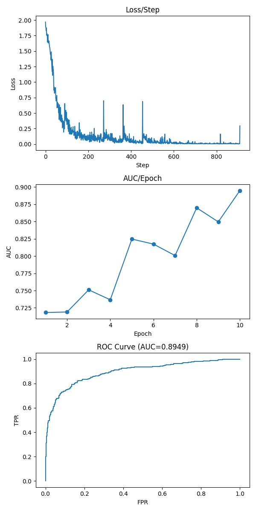
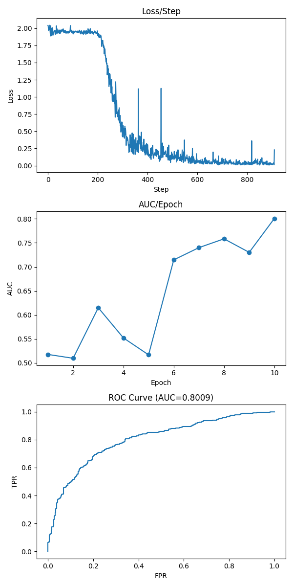
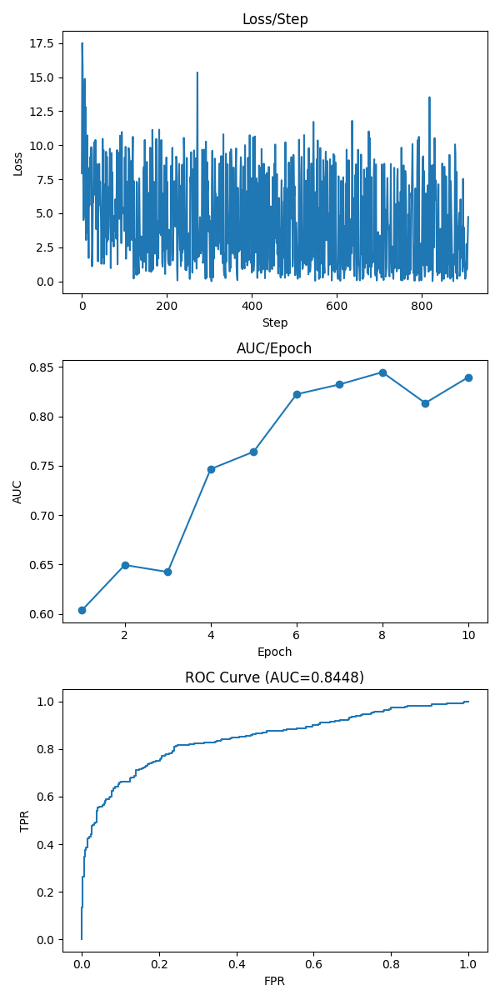
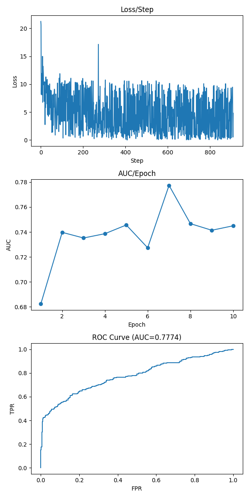

# DCASE 기계 이상음 탐지 · pump 증강 실험

2025년 봄 **AI 융합 캡스톤 디자인(EE488C)**에서 정상 기계음으로 학습한 모델이 비정상 소리를 탐지하는 팀 프로젝트를 진행했습니다. 팀의 CNN14+KNN과 Noisy-ArcMix 모델로 pump 데이터의 증강 유무를 비교하고, 학습 곡선과 ROC 곡선을 분석했습니다.

## 실험과 역할

팀이 구성한 모델을 이용해 pump 학습·평가를 실행하고 증강 적용 결과를 비교했습니다. CNN14+KNN은 학습한 특징의 거리 정보를, Noisy-ArcMix는 각도 기반 학습을 이용하는 서로 다른 접근입니다. 두 모델의 결과를 같은 지표인 ROC AUC로 살펴봤습니다.

## 결과

| 모델 | 증강 없음 · ROC AUC | 증강 적용 · ROC AUC |
|---|---:|---:|
| CNN14+KNN | 0.8949 | 0.8009 |
| Noisy-ArcMix | 0.8448 | 0.7774 |

두 모델 모두 이 실험 설정에서는 증강 후 AUC가 낮아졌습니다. 정상음의 변형이 이상 탐지에 필요한 특징까지 바꿀 수 있다는 가능성을 검토했고, 최종 팀 제출 모델에는 해당 증강을 적용하지 않았습니다. 이 비교만으로 모든 음성 증강 방법의 효과를 일반화할 수는 없습니다.

## 실험 그래프

각 그래프는 위에서부터 학습 손실, epoch별 AUC, ROC 곡선을 보여줍니다.

### CNN14+KNN

| 증강 없음 | 증강 적용 |
|---|---|
|  |  |

### Noisy-ArcMix

| 증강 없음 | 증강 적용 |
|---|---|
|  |  |
